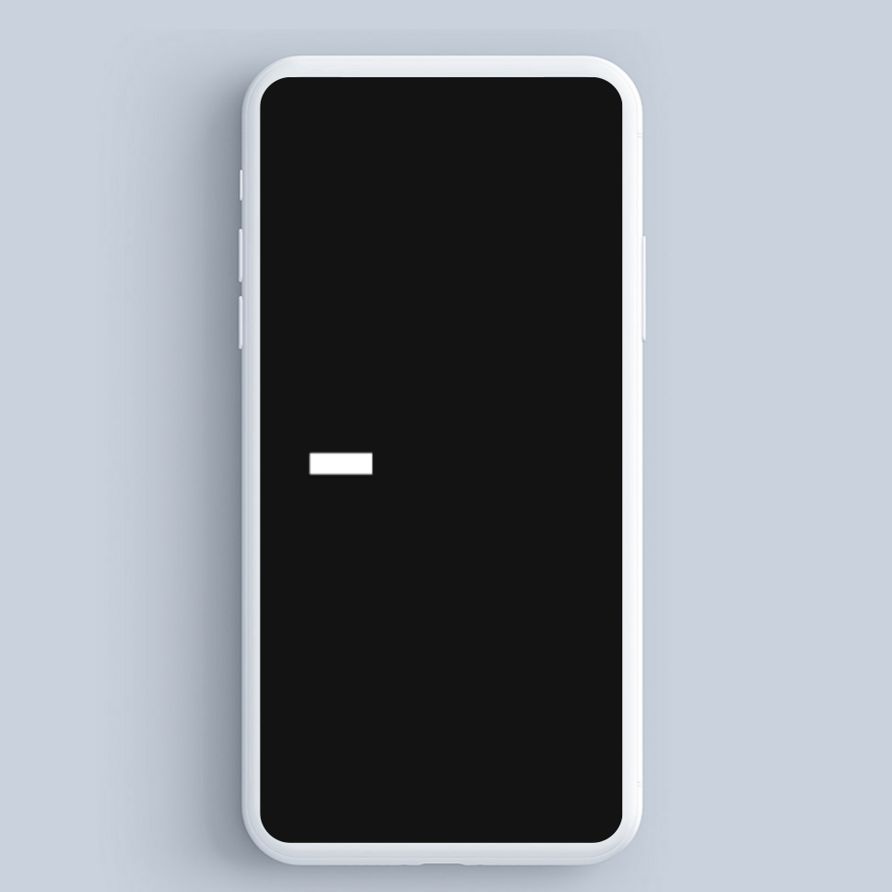

# Fancy Text Reveal
[](https://pub.dev/packages/fancy_text_reveal)   


## Getting Started 🎨

First, add `fancy_text_reveal` as a dependency in your pubspec.yaml file.

```yaml
dependencies:
  fancy_text_reveal: any
```


## Demo 👀


## Usage 🎨
To use is simple, just do this:

    @override
      Widget build(BuildContext context) {
        return FancyTextReveal(
          child: Text('You are Awesome!')
        );
      }


#### Properties Parameter
Here, you can pass:
* decoration for custom decoration of reveal container;
* milliseconds in int for animation duration;
* verticalSpacing for spacing;
* horizontalSpacing for spacing;
